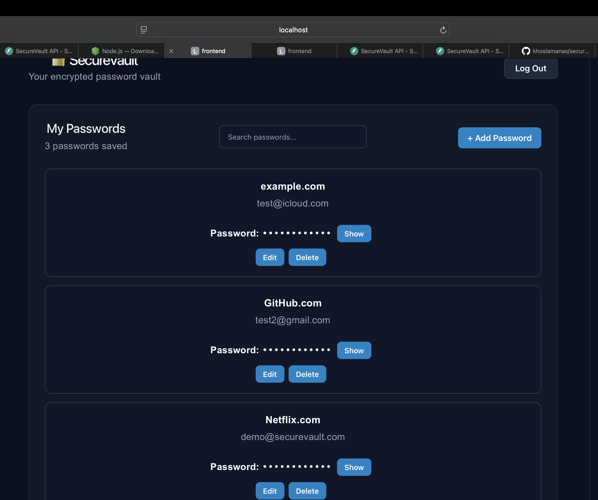

# 🔐 SecureVault

SecureVault is a full-stack password manager built with **React, FastAPI, PostgreSQL, and Python**. It allows users to securely create an account, authenticate, and manage encrypted password entries through a modern web interface.

This project was built as a cybersecurity-focused portfolio project to demonstrate full-stack development, authentication, encryption, database management, API security, and automated testing.
## 🖥️ Application Preview


## ✨ Features

- User registration and login
- Password hashing with bcrypt
- JWT-based authentication
- Protected API endpoints
- Encrypted password storage using Fernet encryption
- Create, view, edit, and delete vault entries
- Secure password generator
- Show/hide stored passwords
- Search vault entries by website or username
- Session handling with automatic logout for expired authentication
- Responsive dark-themed user interface
- PostgreSQL database integration
- Automated backend testing with pytest

## 🛠️ Tech Stack

### Frontend

- React
- Vite
- JavaScript
- CSS
- Fetch API

### Backend

- Python
- FastAPI
- SQLAlchemy
- Pydantic
- PostgreSQL
- bcrypt
- JSON Web Tokens (JWT)
- Fernet encryption

### Testing

- pytest
- HTTPX
- Separate PostgreSQL test database

## 🔒 Security

SecureVault implements several security concepts commonly used in modern web applications.

### Password Hashing

Account passwords are hashed using **bcrypt** before being stored in the database. Plain-text account passwords are never stored.

### Vault Encryption

Passwords stored inside the vault are encrypted using **Fernet symmetric encryption** before being written to the database.

### Authentication

SecureVault uses **JWT access tokens** to authenticate users and protect private API endpoints.

### Authorization

Vault operations are associated with the authenticated user so users cannot access or modify another user's vault entries.

### Environment Variables

Sensitive configuration values such as the JWT secret, database connection information, and encryption key are stored in environment variables and excluded from Git version control.

> SecureVault is an educational portfolio project and has not undergone a professional security audit. It should not be used to store real-world sensitive credentials.

## 🧪 Automated Testing

The backend includes automated tests covering important authentication, encryption, authorization, and API functionality.

Current test suite:

**12 tests passing**

Tests include:

- Health endpoint
- User registration
- Duplicate account prevention
- Password hashing and verification
- Fernet encryption/decryption
- Authentication failures
- Invalid JWT handling
- Password generator authentication
- Password generator validation
- Cross-user vault protection

Run the tests with:

```bash
cd backend
source venv/bin/activate
python -m pytest -v
```

## 📁 Project Structure

```text
securevault/
├── backend/
│   ├── app/
│   │   ├── main.py
│   │   ├── database.py
│   │   ├── models.py
│   │   ├── schemas.py
│   │   └── security.py
│   └── tests/
│
├── frontend/
│   ├── src/
│   │   ├── App.jsx
│   │   ├── App.css
│   │   └── main.jsx
│   └── package.json
│
├── .gitignore
└── README.md
```

## 🚀 Running SecureVault Locally

### 1. Clone the repository

```bash
git clone https://github.com/khoslamanas/securevault.git
cd securevault
```

### 2. Backend Setup

```bash
cd backend

python3 -m venv venv
source venv/bin/activate

pip install -r requirements.txt
```

Create a `.env` file and configure the required environment variables for the database, JWT secret, and Fernet encryption key.

Start the FastAPI server:

```bash
uvicorn app.main:app --reload
```

The backend runs at:

```text
http://127.0.0.1:8000
```

FastAPI documentation is available at:

```text
http://127.0.0.1:8000/docs
```

### 3. Frontend Setup

Open another terminal:

```bash
cd frontend
npm install
npm run dev
```

The frontend runs at:

```text
http://localhost:5173
```

## 🔑 Main API Endpoints

| Method | Endpoint | Purpose |
|---|---|---|
| GET | `/api/health` | Check API health |
| POST | `/api/register` | Create an account |
| POST | `/api/login` | Authenticate user |
| GET | `/api/me` | Get authenticated user |
| GET | `/api/vault` | Retrieve vault entries |
| POST | `/api/vault` | Create vault entry |
| PUT | `/api/vault/{entry_id}` | Update vault entry |
| DELETE | `/api/vault/{entry_id}` | Delete vault entry |
| GET | `/api/generate-password` | Generate secure password |

## 🎯 What I Learned

Building SecureVault helped me gain practical experience with:

- Designing REST APIs with FastAPI
- Building a React frontend that communicates with a backend API
- PostgreSQL database design and SQLAlchemy
- Authentication and authorization
- Password hashing
- Symmetric encryption
- JWT session management
- Protecting application secrets with environment variables
- Automated API and security testing
- Debugging full-stack applications
- Git and GitHub version control

## 🔮 Future Improvements

Potential future improvements include:

- Password-strength analysis
- Multi-factor authentication
- Email verification and account recovery
- Improved key management
- Rate limiting
- Additional automated security tests
- Deployment with production-grade infrastructure

## 👨‍💻 Author

**Manas Khosla**

Computer Science Student  
Thompson Rivers University

GitHub: [khoslamanas](https://github.com/khoslamanas)